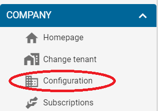

# Overview

1\) Imagine you are the end user (tenant) of an equipment, let's say a robotic arm in this case, to which you are subscribed. Next, we give an overview of MYWAI™ EaaS web interface and its main features. When you launch the platform, you should see the log-in interface as showed in the figure. Just enter your Username and Password.

2\) Next, you have to select the company you want to log in, which corresponds to the **Enterprise** level according to the [ISA-88 standard](https://www.isa.org/standards-and-publications/isa-standards/isa-standards-committees/isa88), by cliking on the .png>) icon.

3\) You should be able to see your homepage, displaying basic information about your assets, like physical geolocation and KPIs.

.png>)

At any time you are able to come back to this homepage, by cliking on Company -> Homepage

.png>)

In this menu you can click on the .png>) icon, if you need to go back to select a different company.&#x20;

4\) If you click on Company -> Configuration

you are able to edit the details of your company

.png>)

5\) You can also manage details of your subscription by clicking on Company -> Subscriptions

.png>)

6\) If you want to see more details about your equipment, click on Assets -> Equipment.

.png>)

7\) Now, you should be able to see the list of your equipments

.png>)

8\) To see more details about your equipment, click on the magnifying glass symbol, as showed in the figure

.png>)
